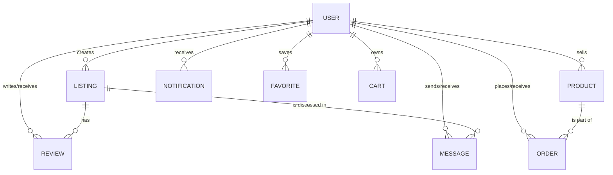

# Database Design

PawHub uses MongoDB as its primary data store, integrated via Mongoose. The schema is designed for quick reads with strategic denormalization, utilizing extensive indexing to support marketplace query patterns.

## Entity Relationship Diagram (ERD)

## Schema Details

### 1. User (`src/server/models/user.ts`)
Stores account information, role (`admin`, `verifiedSeller`, `petOwner`), authentication credentials, and verification status.

### 2. Listing (`src/server/models/listing.ts`)
Stores pet marketplace listings (Adoption, Rehome, Sale).
- **Key Fields**: `petCategory`, `title`, `breed`, `priceInr`, `status`.
- **Indexes**: Compound index on `(status, listingType, petCategory, city, createdAt)`. Text index on `title`, `breed`, `description`.

### 3. Product (`src/server/models/product.ts`)
Stores e-commerce physical items.
- **Key Fields**: `category`, `title`, `priceInr`, `stockQuantity`.
- **Indexes**: Compound index on `(isActive, category, createdAt)`.

### 4. Order (`src/server/models/order.ts`)
Stores transactions between buyers and sellers.
- **Key Fields**: `productId`, `buyerId`, `sellerId`, `quantity`, `totalPriceInr`, `status`.
- **Indexes**: `buyerId_createdAt`, `sellerId_createdAt`.

### 5. Review (`src/server/models/review.ts`)
Stores product and listing reviews.
- **Indexes**: Unique compound index on `(listingId, reviewerId)` to prevent duplicate reviews from the same user.

### 6. Message (`src/server/models/message.ts`)
Stores chat payloads.
- **Indexes**: Compound index on `(senderId, receiverId, createdAt)` for efficient conversation fetching.

### 7. Notification (`src/server/models/notification.ts`)
Stores system alerts.
- **Indexes**: `(userId, isRead, createdAt)` for fast unread counts.

## Scalability Considerations

- **Pagination**: All list queries use `skip` and `limit` to prevent loading entire collections into memory.
- **Denormalization**: Some fields like `isVerifiedSeller` are duplicated on the `Listing` and `Product` models to avoid `$lookup` joins on massive queries.
- **Text Search**: MongoDB's native `$text` index is utilized for full-text search on Listings and Products.
