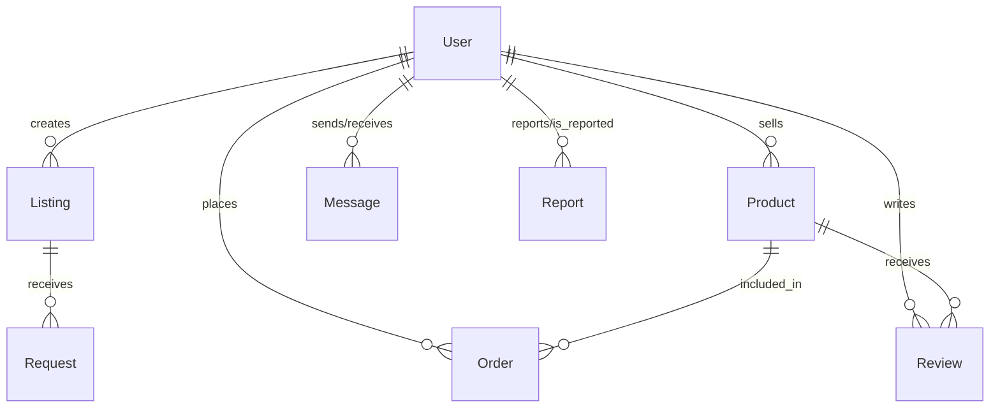

# Database Design

PawHub uses **MongoDB** as its primary datastore, utilizing Mongoose schemas to enforce strict typings and relationship references.

## 📊 Entity Relationship Diagram

---

## 🗄️ Core Models

### 1. UserModel (`users`)
Stores both Buyers and Sellers. Role-based access control and Trust & Safety status are embedded here.
- `_id`: ObjectId
- `name`, `email`, `password`: Core Auth
- `role`: `user` | `admin`
- `userType`: `petOwner` | `seller`
- `isVerifiedSeller`: Boolean (Approved by admin)
- **T&S Fields**: `strikeCount`, `warningCount`, `accountStatus` (`active`, `suspended`, `banned`), `suspendedUntil`

### 2. ListingModel (`listings`)
Peer-to-peer pet adoption and rehoming posts.
- `sellerId`: Ref `User`
- `listingType`: `adopt` | `rehome`
- `title`, `description`, `breed`, `age`, `gender`, `priceInr`
- `images`: Array of Cloudinary URLs
- `status`: `available` | `pending` | `adopted`
- `location`: Embedded Document (`city`, `state`, `coordinates`)

### 3. ProductModel (`products`)
E-commerce inventory for verified sellers.
- `sellerId`: Ref `User`
- `name`, `description`, `price`, `stock`, `category` (Food, Toy, Accessory, Grooming)
- `images`: Array of Cloudinary URLs
- `rating`: Average rating computed from Reviews

### 4. OrderModel (`orders`)
E-commerce transactions.
- `buyerId`: Ref `User`
- `sellerId`: Ref `User`
- `items`: Array of Objects (`productId`, `quantity`, `price`)
- `totalAmount`: Number
- `status`: `pending` | `paid` | `shipped` | `delivered` | `cancelled`
- `paymentId`: String (Razorpay reference)

### 5. ReportModel (`reports`)
Polymorphic entity for Trust & Safety flags.
- `reporterId`: Ref `User`
- `reportedUserId`: Ref `User`
- `entityType`: `listing` | `product` | `user` | `message` | `review`
- `entityId`: Ref (Dynamic)
- `status`: `pending` | `resolved_warned` | `resolved_removed` | `resolved_banned` | `dismissed`

### 6. MessageModel (`messages`)
Real-time chat persistence.
- `senderId`: Ref `User`
- `receiverId`: Ref `User`
- `listingId`: Ref `Listing` (Context context for the chat)
- `content`: String
- `read`: Boolean

---

## ⚡ Indexing Strategy

To guarantee extreme performance at scale, the following compound and text indexes are applied:
- **Listings**: Text Index on `title`, `breed`, `description` for rapid marketplace searches. Compound indexes on `{ city: 1, listingType: 1 }` for geographic filtering.
- **Products**: Text Index on `name` and `category`. Compound index on `{ sellerId: 1, stock: -1 }`.
- **Messages**: Compound index on `{ senderId: 1, receiverId: 1, createdAt: -1 }` for instant chat history loads.
- **Reports**: Compound index on `{ entityId: 1, reporterId: 1 }` to enforce idempotency (preventing users from reporting the exact same item multiple times).
