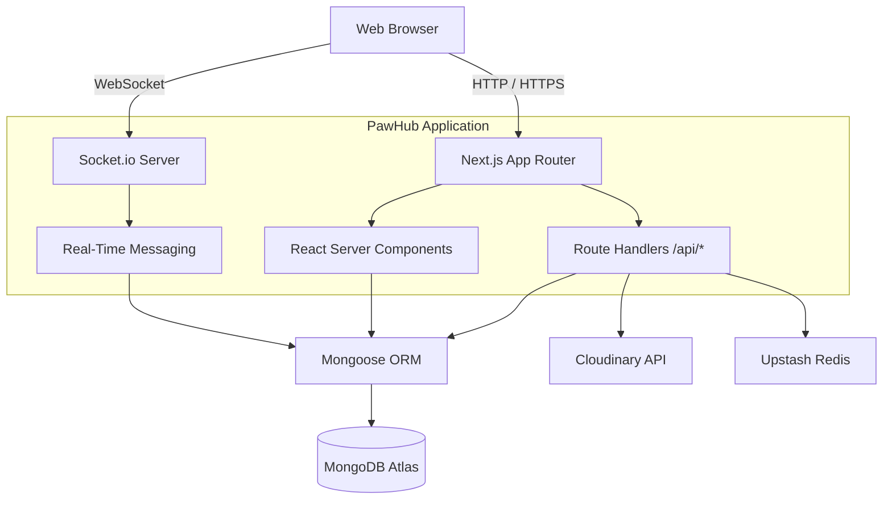
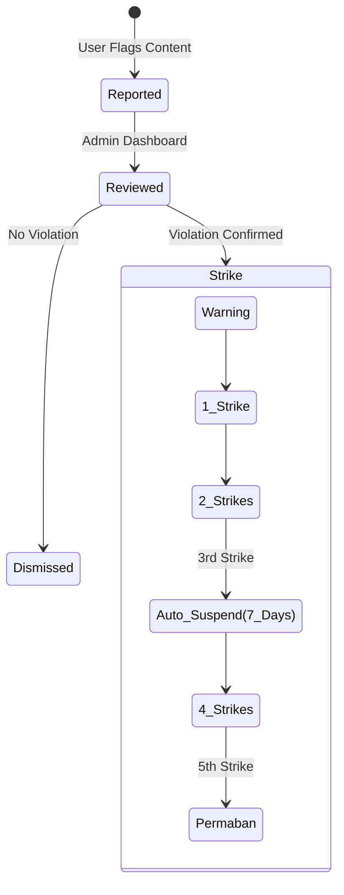

# System Architecture

PawHub is a full-stack marketplace application built on **Next.js 15 (App Router)** and **MongoDB**. It serves as a dual-sided platform facilitating both peer-to-peer pet adoption/rehoming and B2C pet e-commerce.

---

## 🏗️ Overall Architecture

PawHub utilizes a standard monolithic full-stack architecture running inside a Node.js runtime. 

- **Frontend**: React 19 server and client components, utilizing Tailwind CSS for styling and Next.js App Router for routing.
- **Backend API**: Next.js Route Handlers (`src/app/api`) serving RESTful JSON endpoints.
- **Database**: MongoDB hosted on Atlas, accessed via Mongoose ORM.
- **Real-time Layer**: A custom Next.js server (`server.js`) wrapping the Next.js app to inject Socket.io for real-time messaging.

---

## 🔐 Authentication Flow

PawHub uses **NextAuth.js** with JWT strategy.

1. **Credentials Login**: User submits email/password. System verifies via bcrypt and checks `accountStatus` for suspensions/bans.
2. **Google OAuth**: User signs in with Google. System automatically provisions an account if one does not exist, while still enforcing Trust & Safety bans.
3. **Session State**: The JWT token contains `id`, `role`, and `status`. NextAuth `middleware.ts` protects `/dashboard`, `/admin`, and `/seller` routes.

---

## 🛒 Pet Marketplace Flow (Adoption/Rehoming)

1. **Creation**: Verified Sellers or Pet Owners create a Listing, uploading images to Cloudinary.
2. **Discovery**: Buyers browse listings with complex Mongoose queries (breed, price, city).
3. **Interest**: Buyers send a "Request" to the seller.
4. **Approval**: Seller approves the request from their dashboard.
5. **Communication**: Upon approval, a Socket.io chat room is unlocked between the buyer and seller.

---

## 🛍️ Product Marketplace Flow (E-Commerce)

1. **Inventory**: Verified Sellers create physical Products (Food, Toys, Accessories).
2. **Cart**: Buyers add Products to their local database-backed cart.
3. **Checkout**: Buyer proceeds to checkout to create the order.
4. **Fulfillment**: Order is marked `pending`. Seller dashboard shows new order to be shipped.

---

## 🛡️ Trust & Safety System (Moderation)

PawHub employs an automated striking engine to govern the marketplace.

- **Polymorphic Reporting**: Users can report Listings, Products, Users, Messages, or Reviews.
- **Strike System**: Admins resolve reports. If content is removed, the violator automatically receives strikes. Accumulating 3 strikes results in an automatic 7-day NextAuth lockout. 5 strikes results in a permanent ban.
