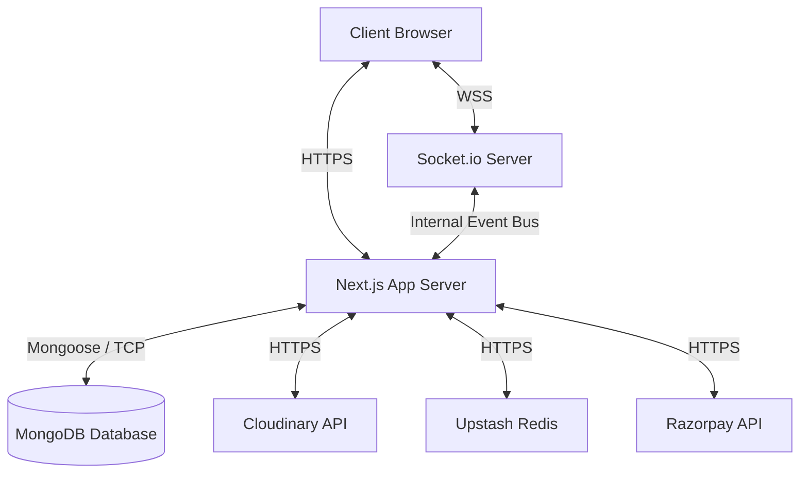

# PawHub System Architecture

This document provides a high-level overview of the PawHub platform architecture.

## Overview

PawHub is built as a monolithic Next.js 15 App Router application with a custom Node.js/Express server wrapper to support real-time WebSocket communication via Socket.io.

## Core Stack

1. **Frontend**: Next.js 15 (React 19), Tailwind CSS, Lucide React (Icons), Sonner (Toasts)
2. **Backend**: Next.js App Router Route Handlers (`/api/*`), Socket.io
3. **Database**: MongoDB (via Mongoose ORM)
4. **Authentication**: NextAuth.js (Credentials Provider)
5. **Infrastructure Tools**:
   - Upstash Redis: Rate Limiting & Session caching (planned)
   - Cloudinary: Media Storage & Optimization
   - Razorpay: Payment Processing

## Architecture Diagram

## Key Components

### 1. Custom Server (`server.js`)
Since Next.js App Router operates completely statelessly in serverless environments, establishing stateful persistent connections (like Socket.io) requires a custom server instance. The `server.js` file boots an Express server, attaches a Socket.io instance, and delegates HTTP handling to Next.js.

### 2. File Structure & Routing
- `src/app/(auth)`: Public routes for authentication (Login, Signup, OTP).
- `src/app/(main)`: Core public application routes (Home, Shop, Pet Directory).
- `src/app/(dashboard)`: Protected dashboard routes for different roles (Admin, Seller, Buyer).
- `src/app/api`: Serverless backend endpoints organized by resource (`/products`, `/orders`, `/listings`).

### 3. Rate Limiting Layer
Located in `src/lib/ratelimit.ts`, this layer uses `@upstash/ratelimit` to define custom rate-limiting sliding windows (e.g., Auth Limits, Checkout Limits, API limits) to prevent abuse and brute force attacks.

### 4. Media Upload Pipeline
Located in `src/lib/cloudinary.ts`. All file uploads (images, verification documents, videos) pass through this utility. It validates MIME types, dimensions, and automatically transforms images into the `.webp` format for performance optimization.

### 5. Security & Authorization
NextAuth.js manages authentication state. Server-side validation uses Zod schemas (`src/lib/validators/*`) to ensure data integrity before reaching the database layer. Role checks are systematically enforced in `src/app/api/*` handlers.
